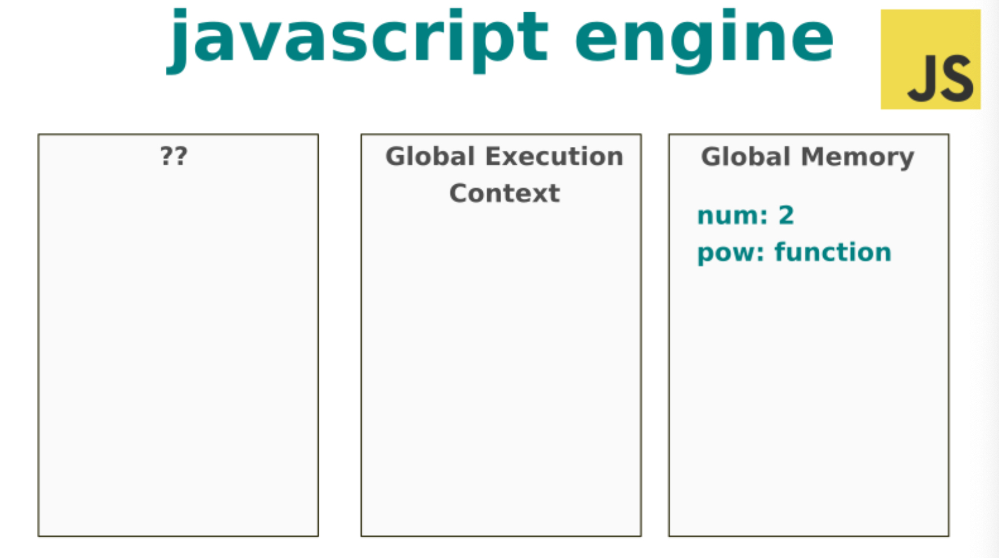
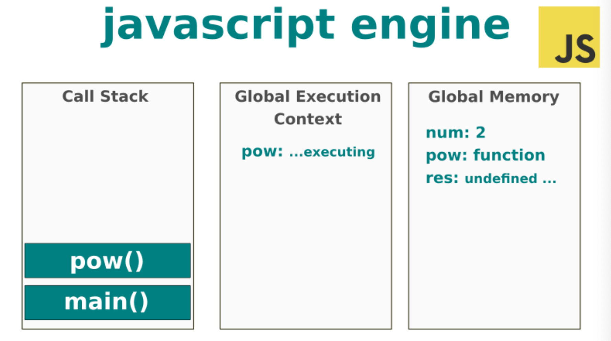
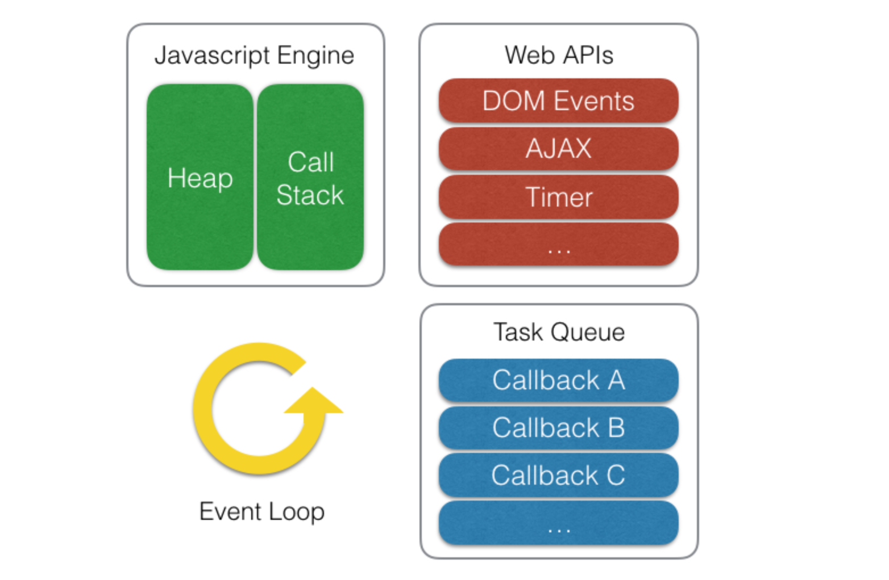

# Event Loop

> Call Stack, Task Queue(CallBack Queue), Event Loop 

자바스크립트의 특징은 **단일 스레드**기반의 언어이다.
또한 브라우저에서 자바스크립트를 실행할 때마다 자바스크립트 엔진은 컴파일러가 이해할 수 있는 언어로 변환하는 단계를 거친다.
브라우저에서 자바스크립트를 실행하기 위해서는 컴파일러가 이해할 수 있는 언어로 변환해야하고 이러한 역할을 **자바스크립트 엔진**이 담당한다.


## 자바스크립트 엔진

자바스크립트 엔진은 두개의 메인 컴포턴트로 구성되어 있다.

- Memory heap : 메모리 할당이 일어나는 곳
- Call stack : 스택 프레임 코드가 실행되는 곳


### 실행 컨텍스트

실행 컨텍스트(Execution Context)는 scope, hoisting, this, function, closure 등의 동작원리를 담고 있는 자바스크립트의 핵심 원리이다.

실행 컨텍스트는 **실행 가능한 코드를 형상화하고 구분하는 추상적인 개념**이다.

> 실행 컨텍스트는 실행 가능한 코드가 실행되기 위해 필요한 환경


코드를 실행하기 위해 아래와 같은 정보를 알고 있어야한다.

- 변수 : 전역, 지역, 매개변수, 객체의 프로퍼티
- 함수 선언 (함수 표현은 제외)
- 변수의 유효범위 (Scope)
- this

또한 Javascript는 **전역 실행 컨텍스트**(global execution context) 뿐만 아니라 **전역 메모리**(Global Memory)도 생성한다.


```javascript
const num = 2;

function pow(num) {
  return num * num;
}
```

위의 코드를 실행하면 자바스크립트 엔진은 변수, 함수 선언을 전역 메모리에 저장한다.




### 콜 스텍

위에서는 함수를 선언만 한 것이고, 실제 함수를 호출하면 전역 실행 콘텍스트와 콜스텍이 반응하게 된다.

```javascript
pow();
```



자바스크립트 엔진은 실행 컨텍스트, 전역 메모리 그리고 콜스택을 생성한다. 그리고 함수를 호출하면 로컬 메모리를 가진 로컬 실행 컨텍스트를 생성한다.

**콜 스텍**(Call Stack)은 함수 호출을 일시적으로 저장하고 관리한다. 이렇기 때문에 last In First Out(LIFO) 형식을 가진다.


#### Javascript는 단일 스레드 프로그래밍 언어이다. 즉 단일 콜 스텍을 가지고 있고 한 번에 하나의 작업만 가능하다.

> 동기식으로 함수가 실행..

#### 그렇다면 단일 스레드인 자바스크립트가 Ajax나 setTimeout과 같은 비동기 함수를 실행할 수 있을까?


## Browser Event Loop

기본적으로 Javascript에서 비동기 작업은 메인 스레드가 아닌 외부에서 실행된다.
브라우저는 자바스크립트 엔진 외에도 아래와 같은 것을 제공한다.

- **Web API** : DOM, Ajax, setTimeout, Click 등등..
- **이벤트 루프**
- **테스크 큐**(콜백 큐)

즉, 자바스크립트 엔진은 단일 호출 스텍을 이용하지만 실제 자바스크립트가 구동되는 환경에서는 주로 여러개의 스레드가 사용되고 있으며, 이러한 구동 환경에서 단일 호출 스텍을 사용하는 자바스크립트 엔진과 상호 연동하기 위해 **이벤트 루프**를 사용한다.




### 단일 호출 스택과 Run-to-Completion

`setTimeout` 이나 비동기적 처리가 이루어 진다면. Web API에서 처리가 된 후에 Task Queue로 이동한다.

테스크 큐는 First In First Out이며 Javascript Engine의 Call Stack이 비어있을 경우 테스크 큐에서 Call Stack으로 전달된다.

이러한 것을 `Run to Completion`이라고 하는데 현재 쌓여있는 모든 함수들이 실행을 마치고 스택에서 제거되기 전까지는 다른 어떠한 함수도 실행될 수 없다는 뜻이다.

```javascript
function delay() {
    for (var i = 0; i < 100000; i++);
}
function foo() {
    delay();
    bar();
    console.log('foo!'); // (3)
}
function bar() {
    delay();
    console.log('bar!'); // (2)
}
function baz() {
    console.log('baz!'); // (4)
}

setTimeout(baz, 0); // (1)
foo();
```

위의 코드에서 setTimeout의 Delay 시간이 0이기 때문에 바로 `baz()` 함수가 실행 될 것이라 생각하지만 이미 위 스크립트가 동작하고 있기 때문에 `foo()`의 함수를 포함한 위 스크립트의 동작이 모두 종료 된 다음에 `baz()`함수가 **Task Queue**(callback queue)에서 Call Stack으로 전달된다.

> 즉 실행 순서는 `setTimeout() => 'bar!' => 'foo!' (foo()함수 종료) => 'baz!'(baz() 함수 실행)` 이다.


### 이벤트 루프의 역할

'**현재 실행중인 태스크가 없는지**'와 '**태스크 큐에 태스크가 있는지**' 반복적으로 확인하는 것

- 모든 비동기 API들은 작업이 완료되면 콜백 함수를 태스크 큐에 추가한다.
- 이벤트 루프는 '현재 실행중인 태스크가 없을 때'(주로 호출 스택이 비워졌을 때) 태스크 큐의 첫 번째 태스크를 꺼내와 실행한다.


## EventLoop 알아두면 좋은 것들

### 렌더링 큐

브라우저는 기본적으로 1초에 60프레임을 갱신한다.
자바스크립트 런타임엔 렌더링 큐도 포함된다. 브라우저가 화면을 렌더하는 것도 하나의 콜백으로 처리하고, 콜 스택에 코드가 있으면 렌더링을 하지 못한다.

> 즉 스택이 비워질때까지 기다려야 한다.

랜더링 큐는 **콜스텍 > 랜더 큐 > 테스크 큐** 순의 우선순위를 가진다.


### 비동기 API와 try-catch

```javascript
$('.btn').click(function() { // (A)
    try {
        $.getJSON('/api/members', function (res) { // (B)
            // 에러 발생 코드
        });
    } catch (e) {
        console.log('Error : ' + e.message);
    }
});
```

위의 코드에서 콜백 (B) function이 실행될 때에는 이미 (A) function이 종료된 시점이다. (A)와 (B)는 별도의 컨텍스트에서 실행이 되기 때문에 (B)는 (A)내부의 try-catch 문에 영향을 받지 않는다.

(B) function의 에러를 받아보기 위해서는 (B) function 내부에 try-catch를 구현해야 한다.

```javascript
$('.btn').click(function() { // (A)
    $.getJSON('/api/members', function (res) { // (B)
        try {
            // 에러 발생 코드
        } catch (e) {
            console.log('Error : ' + e.message);
        }
    });
});
```


### Promise와 이벤트 루프

```javascript
setTimeout(function() { // (A)
    console.log('A');
}, 0);
Promise.resolve().then(function() { // (B)
    console.log('B');
}).then(function() { // (C)
    console.log('C');
});
```

위의 실행 순서는 (B) => (C) => (A) 순으로 실행 된다

(A)와 Promise를 이용한 (B) 또한 비동기 처리 이고 둘 다 딜레이가 없지만 (B)와 (C)가 차례로 실행 된 다음에 (A)가 호출 되는 이유는 `then()` 메서드는 테스크 큐가 아닌 **마이크로 태스크 큐**에 추가가 된다. 

이벤트 루프는 테스크 큐보다 마이크로 테스크 큐의 함수들을 우선적으로 처리한다. 그렇기 때문에 `'B' => 'C' => 'A' `순으로 동작하게 된다.

 

### 참고자료

- [Philip Roberts: Help, I’m stuck in an event-loop.](https://vimeo.com/96425312)
- [Tasks, microtasks, queues and schedules](https://jakearchibald.com/2015/tasks-microtasks-queues-and-schedules/)
- [자바스크립트와 이벤트 루프](https://meetup.toast.com/posts/89)
