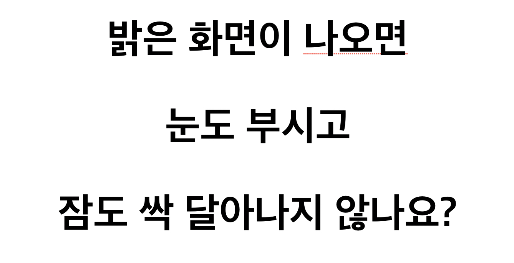
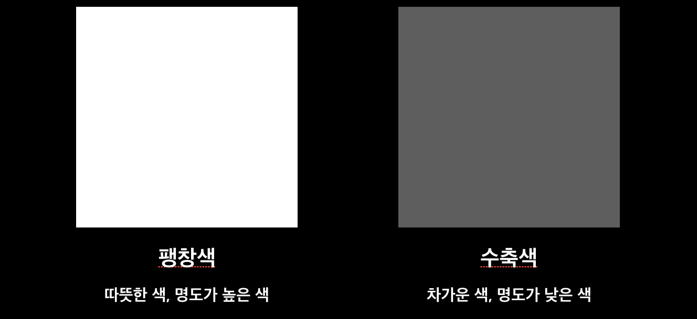
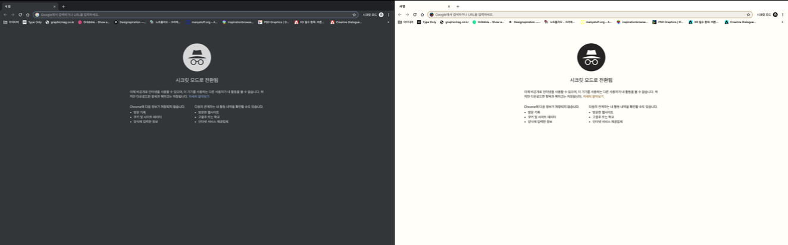
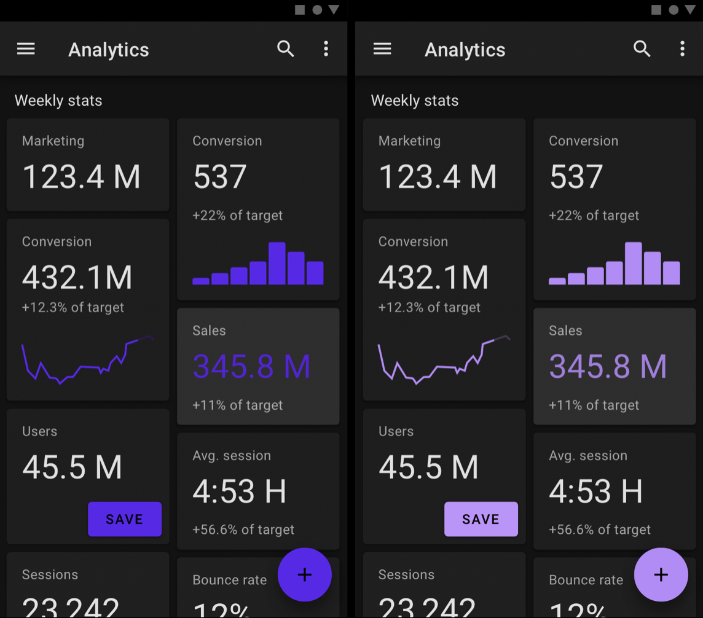
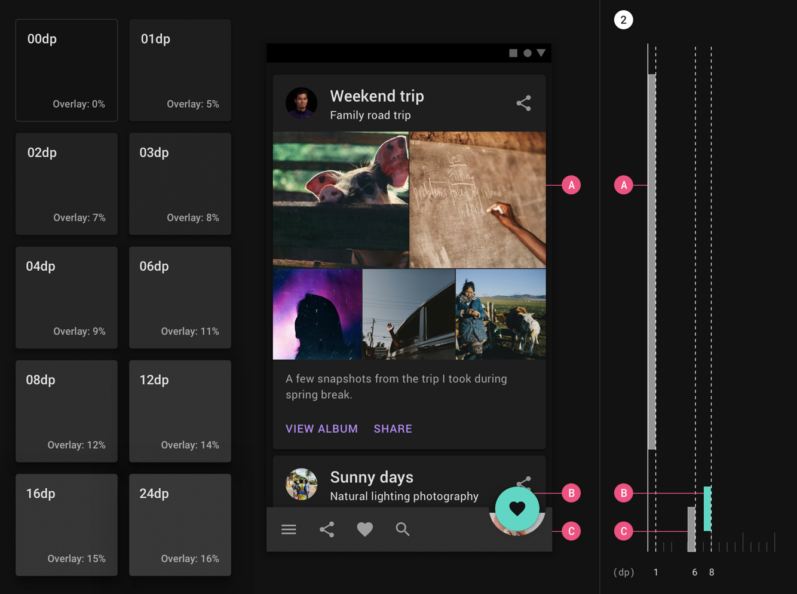
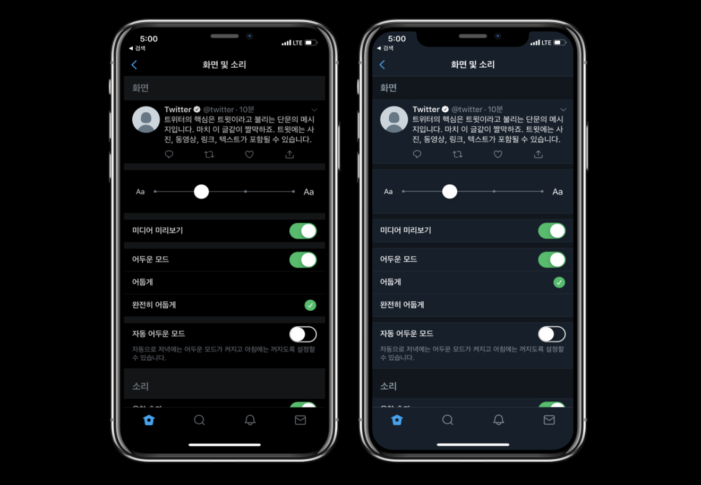

# 프론트엔드가 알고 있으면 좋을 디자인 이야기 - Darkmode

블로그를 만들고 나서, 이런 저런 기능들을 추가하다가 이젠 대세가 되어버린 **Darkmode**를 구현해야 겠다는 생각이 들었다.
단순히 글씨는 하얗게(`#fff`) & 배경은 어둡게(`#000`) 하는 것이 아닌 눈에 피로감이 덜하고 안정감 있는 다크모드를 구현하고 싶었고 디자인으로서 다크모드를 어떻게 접근해야하는지, 어떻게 풀어내는 것이 좋은지 찾아보았다.

> 디자이너 없이 개발자 스스로 디자인을 해야할 때 참고하면 좋을 것 같다.

## 왜 Darkmode를 만드나요?

크게 5가지 이유가 있을 듯 하다.

1. 기술의 발전
2. 사용자의 활동 시간
3. 접근성 향상
4. 컨텐츠 주목도 향상
5. 개인화, 고급화

### 1. 기술의 발전

이제는 아이폰이던 안드로이드던 LCD가 아닌 OLED 디스플레이가 탑재되는 것이 흔한 시대가 되었다. LED에서 OLED로 대체되고 있는 이유는 색을 표현하는 방식 변경으로 인한 **디스플레이 얇기**가 얇아진 것, **명암비**가 뛰언난 것, **전력소모**가 낮은 점 때문이다.

실제로 LCD의 경우엔 백라이트를 통해 색을 표현하기 때문에 검정을 제대로 표현할 수 없지만, LED의 경우 의도한 검정을 제대로 표현할 수 있다.

### 2. 사용자의 활동 시간

이제는 PC 뿐 아니라, 태블릿, 스마트폰으로 인해 눈을 뜨고 잠들기 직전까지 화면을 바라보는 일이 많이 생겼다.

평소에 어두운 화면 또는 어두운 곳에서 갑작스레 밝은 화면이 나올 경우

<small>다크모드에서 이화면을 보셨다면 욕하셨겠죠..? 👻 </small>

어두운 화면보다 눈에 피로가 빨리 쌓이게 된다. 그렇기에 어두운 화면을 사용자에게 제공하므로써 서비스를 사용할 때 눈의 피로도를 줄일 수 있다.

### 3. 접근성 향상

저시력자, 색약, 밝은 빛에 예민한 사용자들이 보다 쉽게 서비스를 이용할 수 있게 한다.

### 4. 컨텐츠의 주목도 향상

색에는 팽창색과 수축색이라는 것이 있으며, 팽창색일수록 커보이고, 반대로 수축색일수록 축소되어 보인다.

<small>둘 중 어떤 것이 눈에 확 들어오나요? 그리고 어떤 것이 더 편안한가요? </small>

그렇기 때문에 수축색을 씀으로 컨텐츠에 집중도를 더 높일 수 있다고 한다.

또한 영상콘텐츠가 주력인 서비스에서는 영화관 같은 느낌을 주기 위해서 다크모드를 사용하기도 한다.

### 5. 개인화 & 고급화

**개인화**의 경우엔 크롬의 시크릿 모드가 적절한 예시일 듯 한데, 해당 페이지가 흰색이었다면 어두운 색을 쓰는 것 만큼 효과적으로 비밀스러운 느낌을 주기 힘들었을 것이다.

**고급화**의 경우엔 카카오블랙, 현대카드 Black이 해당 Case에 포함되며 브랜딩 적인 측면도 있다.

## Dark UI란?

### 1. Dark와 Black은 다르다

먼저 알고 가야할 것은 **검정(Black)**과 **Dark(어두움)**은 다르다.
우리가 Darkmode라고 하는 이유는 단순희 흰 배경을 Black으로 바꾸는 것이 끝이 아니라 어두움으로 UI을 잘 표현하는 것 이기 때문이다.

위 두 화면으 보았을 때 왼쪽은 완벽한 Black(#000)을 배경색으로 오른쪽은 #121212를 배경색으로 깔았다. 
Black을 사용했을 땐 그림자가 보이지 않아 평평하게 보이지만, #121212를 사용했을 때에는 UI의 입체감, 위계가 명확히 구분되며, 이로인해 평면적인  UI를 개선 할 수 있다.

> 즉, 흰화면에 보이는 그림자가 다크모드에서도 보이게 할 수 있다.

### 2. 대비를 줄여야 한다.

너무 밝은 UI는 사용자의 눈을 금방 피로하게 한다. 이 이야기를 반대로 하면 어두운 인터페이스에 너무 밝은 요소(강한요소)들이 들어가면 사용자의 눈에 피로를 가져다 줄 수 있다.

또한 보통 Lightmode에서 주로 사용하는 컬러를 Darkmode에 적용하면 잘 보이지 않는다. 그렇기에 Lightmode 보다 메인 컬러의 채도를 낮추고 좀 더 밝은 색상을 사용하는 것이 좋다.

### 3. Overlay

실제 UI를 디자인 할 때 흰 배경에서도 원초적인 Black(#000)를 잘 사용하지 않는다고 한다. 그것과 마찬가지로 검은 배경에서도 흰색(#fff)을 있는 그대로 사용하는 것보단 투명도를 조절하여 눈에 편안한 조합을 찾는 것이 좋다.

실제로 트위터 같은 경우에는 다크모드를 사용 시간에 따라 자동으로 선택 할 수도 있고 완전 어둡게, 혹은 적당히 어둡게 등 자유롭게 설정 할 수 있으며, 유저 선호도 또한 적당히 어두운 화면을 더 선호한다고 한다.

위의 내용들을 찾아보면서 새로 알게된 사실은 다크모드를 쓴다고 해서 **가독성이 올라가는 것은 아니라는 점**이다.
실제로는 `밝은 화면 + 어두운 글씨` 가 `어두운 화면 + 밝은 글씨` 보다 가독성이 더 뛰어나다고 한다.

스스로 사이드 프로젝트를 시작 할 때 가장 막막하고 어려운 부분 중 하나가 UI이 인데, 위의 내용들만 알고 있어도 보다 더 나은 Darkmode 제작이 가능하지 않을까 생각한다.

끗 

### 참고자료

- [material.io](https://material.io/design/color/dark-theme.html#properties)

- [8 Tips for Dark Theme Design - UX Planet](https://uxplanet.org/8-tips-for-dark-theme-design-8dfc2f8f7ab6)

- [다크테마 파헤치기](https://brunch.co.kr/@outlines/39)
