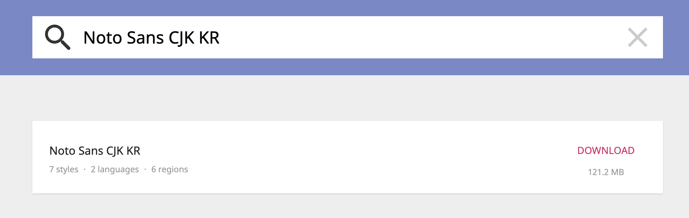
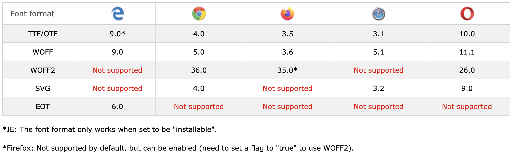
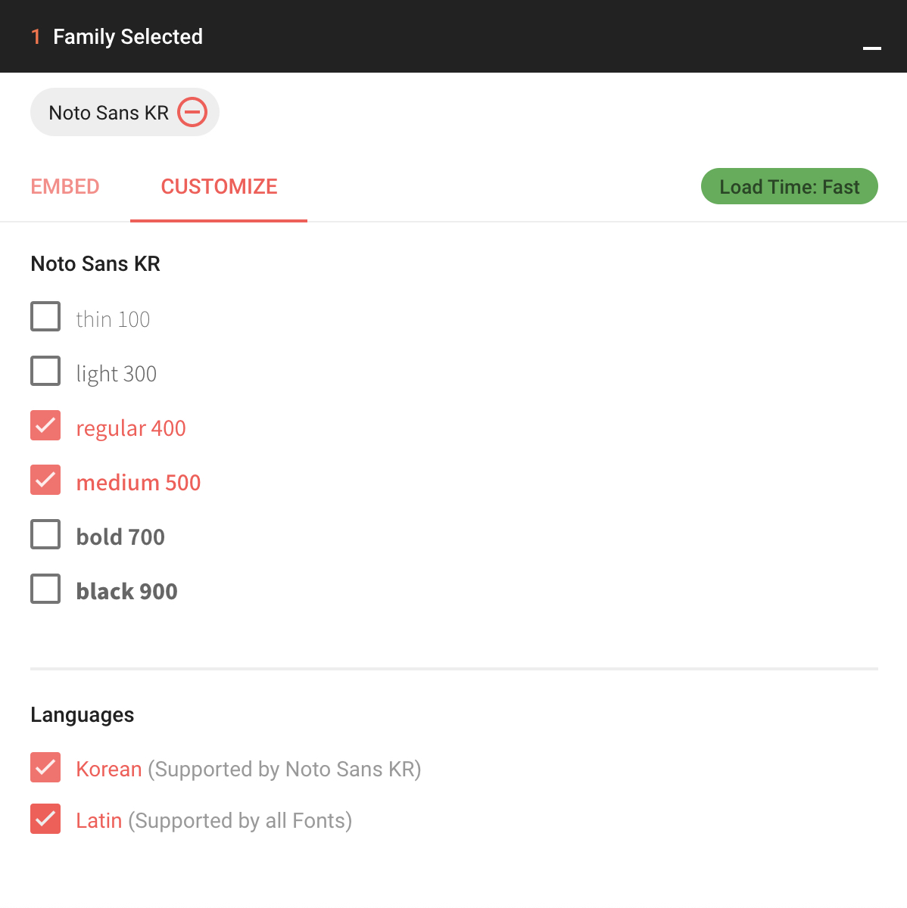
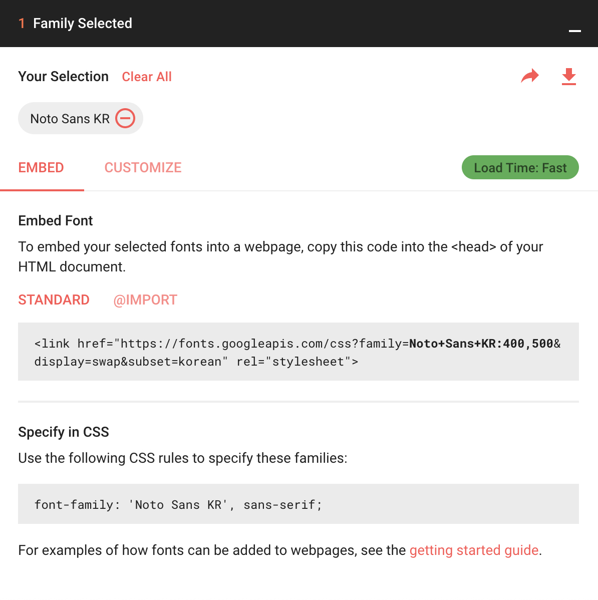
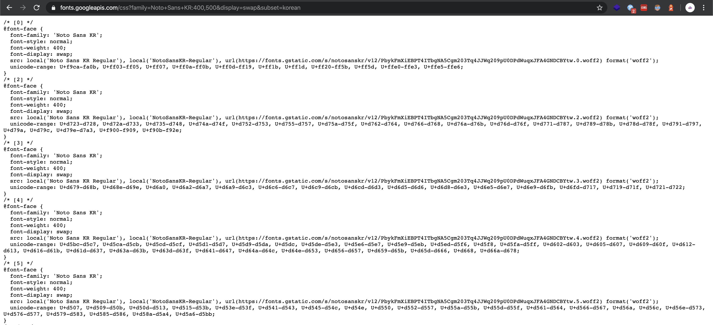

# 구글폰트와 웹폰트 최적화

기본적으로 폰트를 지정해주지 않는다면 브라우저 별로 기본 설정된 폰트들이 출력된다.

그렇기에 보통 웹 개발을 할 때  `font-family`를 사용하여 자신이 원하는 폰트가 나올 수 있게 설정을 하게 되는데, 단순히 `font-family`에 사용할 폰트만 적게 된다면, 컴퓨터에 존재하는 폰트를 사용하게 되기 때문에 해당 폰트가 컴퓨터에 없다면 의도한 대로 웹페이지를 보여줄 수 없게 된다. 그렇기 때문에 우리는 웹 폰트를 통하여 자신의 페이지가 어떠한 환경에서도 동일하게 보여지도록 하게 된다.

 ## 웹 폰트 적용 방법

기본적으로 웹 폰트 사용법은 다음과 같다.

```css
@font-face {
    font-family: 'Noto Sans KR';
    src: url('./fonts/noto-sans-kr.ttf') format('truetype');
}  

.p {
  font-family: 'Noto Sans KR', sans-serif;
}
```

##### @font-face

폰트를 선언 및 정의하는 곳이며, 해당 폰트의 이름(`font-family`)은 무엇인지, 해당 폰트는 어디서(`src`) 가져오는지 등을 설정 할 수 있다.


##### font-family

폰트를 적용하는 명령어이며 해당 폰트를 적용하고 싶은 tag(class 등)에 위의 방법처럼 적용하면 된다.
(여러가지 사유로 해당 폰트가 안 불러와 질 수 있기 때문에 없을 경우를 대비한 fallback 폰트를 지정해주어야 한다.)


위의 방식대로 하면 우리가 보통 컴퓨터에서 사용하는 폰트는 **TTF** 또는 **OTF** 형식 이기에 다음과 같이 폰트를 적용하면 모든 브라우저, 모든 디바이스에서 동일하게 적용 할 수 있다.

하지만 특히 한글이 가능한 `CJK` 의 경우 알파벳만 존재하는 영어와 다르게 중국어, 일본어, 한국어의 문자를 모두 지원해야 하기 때문에 용량이 매우매우 크며 특히 **TTF**와 **OTF** 는 별도의 최적화가 되어 있지 않아 빠르고 신속하게 원하는 폰트를 보여주기 어렵다.




> 🧐 빠르고 신속하게 폰트를 보여줄 방법은 없을까?


## 웹 폰트 최적화 

다행히도 위와 같은 상황을 해결하기 위한 다양한 방법들이 존재한다. 이제부터 폰트 최적화를 위한 몇 가지 방법을 이야기 해보려고 한다.


### 1. 폰트 형식

웹에서 사용할 수 있는 폰트 형식은 TTF, OTF 뿐 아니라 EOT, WOFF, WOFF2 처럼 다양하다.

- **WOFF2** : 폰트에 최적화된 압축 및 처리 알고리즘을 사용하여 다른 형식에 비해서 30% 정도 파일 사이즈가 작다.
- **WOFF** : 기본적인 압축 방식을 통해 폰트의 용량을 줄여서 사용한다.
- **EOT, TTF** : 기본으로 글꼴 압축을 하지 않는다. 용량이 크기에 최적화를 위해 GZIP 압축을 사용하기도 한다.

위의 형식들을 보았을 때 **WOFF2** 가 용량 및 최적화 면에서 뛰어나기에 WOFF2를 사용하는 것이 유리하나 **지원하지 않는 브라우저 들이 존재**해 다양한 브라우저 대응을 해야할 경우 일부 브라우저에서 의도한 결과물을 얻기 힘들 수 있다.




그렇기에 다음과 같이 다양한 폰트 형식을 추가하는 것이 좋다.

```css
@font-face {
    font-family: 'Noto Sans Kr';
    src:
      local('Noto Sans'),
      local('NotoSans'),
      url('./fonts/noto-sans-kr.woff2') format('woff2'),
      url('./fonts/noto-sans-kr.woff') format('woff'),
    	url('./fonts/noto-sans-kr.eot'),
      url('./fonts/noto-sans-kr.eot?#iefix') format('embedded-opentype'),
      url('./fonts/noto-sans-kr.otf') format('opentype');
}
```


**local**의 경우 컴퓨터 내장에 사용하고자 하는 폰트가 있는지 확인하는 코드이다. 이미 폰트가 존재 할 경우 굳이 따로 받아오는 것 보다 해당 폰트를 사용하는 것이 좋기에 명시하는 것이 좋다.

위와 같이 작성 할 경우, 해당 브라우저가 사용가능한 방식을 찾아 사용하게 된다.

**명심해야 할 점**은 폰트가 선언되는 순서가 매우 중요하다. 브라우저가 폰트를 가져올 때 지원하는 형식 중 가장 첫번째 형식을 가져오게 된다. 그렇기 때문에, 최신 브라우저가 WOFF2 방식을 사용하게 하려면 **WOFF2선언을 WOFF 위에** 해야한다.


### 2. 폰트 굵기 및 폰트 스타일

기본 폰트의 경우 굵기, 폰트 스타일(기울임 등등)의 내용이 모두 담겨있다.
실제 내가 만드는 웹 페이지에서 100, 900 등과 같이 매우 얇은 폰트, 매우 굵은 폰트를 사용하지 않거나 기울임 등을 사용하지 않는다면 **사용하지 않는 것들은 제외하고 폰트를 추가할 수 있다.**

웹 폰트의 경우 보통 폰트 굵기별(100, 300, 400, 500, 700, 900), 스타일 별로 각각 나누어 놓은 경우가 많다.
필요한 요소들만 조합하여 아래와 같이 `font-face`를 만들어주면 보다 최적화 된 웹 페이지를 보여줄 수 있다.

```css
@font-face {
    font-family: 'Noto Sans Kr';
    font-style: normal;
    font-weight: 300;
    src:
      local('Noto Sans Light'),
      local('NotoSans-Light'),
      url('./fonts/noto-sans-kr-light-normal.woff2') format('woff2'),
      url('./fonts/noto-sans-kr-light-normal.woff') format('woff'),
    	url('./fonts/noto-sans-kr-light-normal.eot'),
      url('./fonts/noto-sans-kr-light-normal.eot?#iefix') format('embedded-opentype'),
      url('./fonts/noto-sans-kr-light-normal.otf') format('opentype');
}

@font-face {
    font-family: 'Noto Sans Kr';
    font-style: normal;
    font-weight: 400;
    src:
      local('Noto Sans Regular'),
      local('NotoSans-Regular'),
      url('./fonts/noto-sans-kr-light-regular.woff2') format('woff2'),
      url('./fonts/noto-sans-kr-light-regular.woff') format('woff'),
    	url('./fonts/noto-sans-kr-light-regular.eot'),
      url('./fonts/noto-sans-kr-light-regular.eot?#iefix') format('embedded-opentype'),
      url('./fonts/noto-sans-kr-light-regular.otf') format('opentype');
}

@font-face {
    font-family: 'Noto Sans Kr';
    font-style: normal;
    font-weight: 700;
    src:
      local('Noto Sans Bold'),
      local('NotoSans-Bold'),
      url('./fonts/noto-sans-kr-light-bold.woff2') format('woff2'),
      url('./fonts/noto-sans-kr-light-bold.woff') format('woff'),
    	url('./fonts/noto-sans-kr-light-bold.eot'),
      url('./fonts/noto-sans-kr-light-bold.eot?#iefix') format('embedded-opentype'),
      url('./fonts/noto-sans-kr-light-bold.otf') format('opentype');
}
```

[설명] 폰트 300, 400, 700만 추가한 경우


위와 같이 생성하면 `font-weight`가 300, 400, 700인 noto-sans-kr 폰트만 가져오게 된다.

여기서 미처 추가하지 않는 폰트 weight (600, 100, 900)를 사용하게 된다면, 존재하는 가까운 폰트를 보여주며, 사이에 껴있다면 400을 기준으로 더 굵은 폰트는 높은 것을 우선으로, 얇은 폰트는 낮은 것을 우선으로 반영한다.


### 3. 유니코드와 서브셋 폰트

#### 유니코드

그 외에도 `@font-face`에는 `unicode-range`라는 속성을 지원한다. 사용할 유니코드의 범위를 정할 수 있으며 유니코드 범위 내 사용하는 문자가 없으면 웹폰트를 다운로드 하지 않는다.

```css
@font-face {
    font-family: 'Noto Sans Kr';
    font-style: normal;
    font-weight: 700;
    src:
      local('Noto Sans Bold'),
      local('NotoSans-Bold'),
      url('./fonts/noto-sans-kr-light-bold.woff2') format('woff2'),
    unicode-range: U+AC01, U+AC08; // 단위 코드 (각각 지정)
  	unicode-range: U+AC07-AC0A; // 범위 코드 (범위 지정, 사이에 있는 폰트는 모두 반영)
  	unicode-range: U+ff??; // 와일드 카드 (?로 지정, 해당 예시는 일본어만 적용하겠단 뜻)
```

#### 서브셋 폰트

서브셋 폰트(subset font)는 폰트 파일에서 불필요한 글자를 제거하고 사용할 글자만 남겨둔 폰트입니다.

영어와 다르게 한글의 조합은 방대하기 때문에 총 11,172자가 존재하나 이를 모두 사용하지 않기 때문에 자주 사용하는 글자 등만 남겨두고 안쓰는 것들은 제외한 것을 의미합니다. 보통 자주사용하는 것만 추린다면 2,350자가 나오게 됩니다.


> 😢 너무 복잡한데... 이거 쉽게 하는 방법 없을까요..?


## 구글폰트

위의 설정들이 매우 복잡하기에 구글에서는 [구글폰트](https://fonts.google.com/)페이지를 운영하고 있으며 해당 페이지를 통해 클릭 몇번으로 우리가 원하는 폰트를 최적화 하여 사용할 수 있다.



이렇게 필요한 내용만 선택한 후 EMBED를 눌러 link tag를 복사하여 head tag에 넣어주면 된다.



해당 URL에는 폰트 최적화에 필요한 것이 모두 반영된 css가 존재한다.




**구글 폰트의 경우 다수가 사용**하고 있기에 사용자가 다른 페이지에서 해당 URL에서 폰트를 사용하다 접근하였을 경우 추가로 다운받지 않고 그대로 사용 할 가능성이 매우 높아져, 보다 **더 나은 최적화**가 가능해진다.

다만 주의해야 할 점은 현재 구글 폰트는 **WOFF2** 만 지원하고 있어 IE 대응이 필요하면 위의 방식을 사용할 수 없다. 해당 부분은 주의하도록 하자


## 정리

1. IE 지원 계획이 없다면 **[GoogleFonts](https://fonts.google.com/)**를 사용하자.

2. 지원 계획이 있다면 **[Google-Fonts-helper](https://google-webfonts-helper.herokuapp.com/fonts)**를 사용해보자

   (font-face 생성을 쉽게 할 수 있음)

3. google font helper에 원하는 폰트가 없다면, 위의 내용을 토대로 최적화를 하자


### 참고자료

- [웹폰트 최적화](https://developers.google.com/web/fundamentals/performance/optimizing-content-efficiency/webfont-optimization?hl=ko)
- [웹 폰트 사용과 최적화의 최근 동향](https://d2.naver.com/helloworld/4969726)
- [w3schools css3 fonts](https://www.w3schools.com/Css/css3_fonts.asp)
