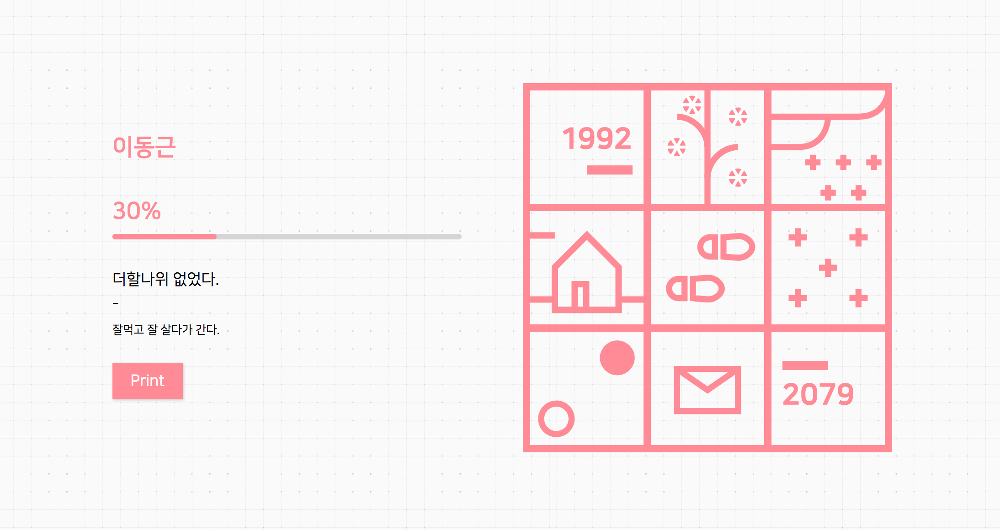
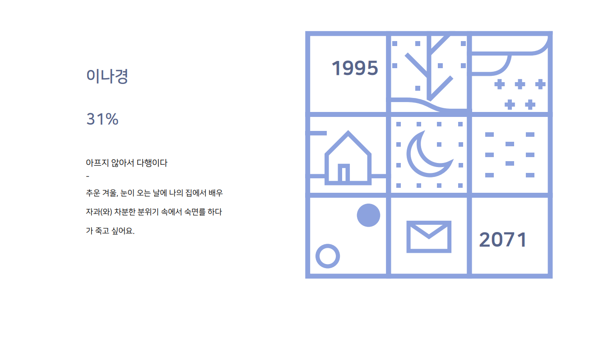
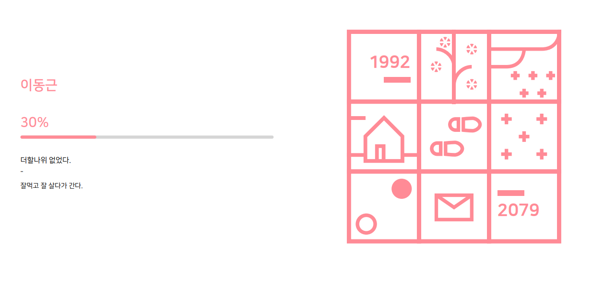

> 해당 글은 2019년 1월에 작성된 글 입니다. 🙏

# 인쇄 시 background 제거 이슈 해결

특정 버튼을 누를 때 Chrome에서 Print를 하는 기능을 구현했었다.

> 위 이미지에서 프린트 버튼을 누르면 아래와 같이 결과물이 나온다.

> 위와 다른 색상이지만 색상은 사용자가 선택한 계절에 어울리는 색상이 나오는 것이며
> 문제는.. 해당 퍼센트 Bar와 오른쪽에 년도에 나오는 밑줄과 년도만 색상이 다르게 나오는 것...

프린트 시에 보여질 CSS를 따로 설정하기 때문에 혹시 Print 시 render 하는 CSS가 잘못되었는지 확인 했다.
CSS상에서 문제를 찾다가 나오지 않는 부분의 공통점을 찾아 냈다.

바로 `background`로 부여된 내용만 나오지 않는 다는 것.

이러한 이슈를 해결하기 위해서 google에 검색을 해보니 Print시에 자동으로 background와 관련된 내용들은 없애고 출력물을 나타낸다고 한다.

> 아마 Print시에 background까지 출력하는 것은 불필요한 잉크낭비를 막기 위함이 아니였을까 싶다.

`-webkit-print-color-adjust:exact;` 이란 내용을 print 시에도 background를 나타내고싶은 Tag 속성에 추가하면 Print 시에도 나온다고 하였고. 해당 Section 부분 하위 TAG에는 모두 Background를 노출 되도록 처리했다. (SCSS 사용)\

> #### GOOOOOOOOOOOOD!

