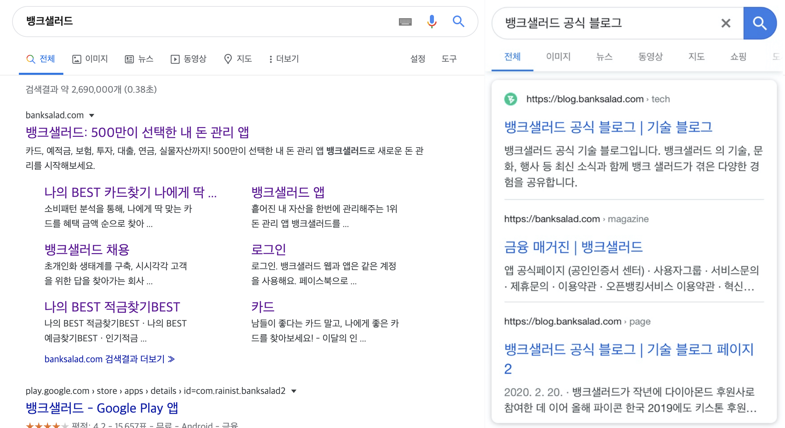

# 검색엔진최적화(SEO) 이것만 따라해도 SEO 100점! (SEO Best Practices)

SEO는 search engine optimizationd의 줄임말로 검색엔진 최적화 라고 합니다. 구글과 네이버와 같은 검색엔진이 이해하기 쉽도록 홈페이지의 구조를 작성하여 검색 결과 상위에 노출될 수 있게 하는 작업 입니다.

검색창에 관련 검색어 상위에 노출되기 위한 요소가 크게 2가지로 나뉩니다.

1. 외부에서 영향을 받는 요소
2. 내부에서 해결 할 수 있는 요소

>  개발적으로 해결 할 수 있는 요소와 아닌 요소로도 구분 할 수 있을 듯..?

### 1. 외부에서 영향을 받는 요소

기본적으로 검색엔진은 콘텐츠의 신뢰도가 높고 좋은 콘텐츠라고 판단되는 것들을 제일 상단에 노출시켜 줍니다.

이러한 요소들은 개발할 때 고려할 수 있는 것들은 아니며, 좋은 게시물을 작성하여 다른 사람들이 facebook과 같은 sns 등을 통해 공유하거나, **유입량이 많아질 경우 검색엔진이 좋은 콘텐츠**라 판단합니다.

또한, 이미 대중의 이미지에 각인되어있는 고유 명사나 이미 많이 사용하고 있는 키워드들의 경우 검색 상단에 노출되는데 큰 공을 들여야 하기에, 관련 키워드들의 검색량을 파악하여 비교적 **낮은 검색 키워드**들을 가져가게 될 경우 **상단에 노출될 가능성**이 높아집니다. 물론 SEO나 서비스의 인지도를 높이면 자연스레 상단 노출이 되긴 하나 마케팅 측면에서 비교적 큰 비용이 발생하게 됩니다.

#### 신경 써야 할 것

- 양질의 콘텐츠를 작성하여 외부 바이럴이 되게 한다.
- 관련 키워드 검색량을 파악하여 비교적 낮은 키워드들을 공략한다.
- SEM등을 활용한다.

### 2. 내부에서 해결 할 수 있는 요소

기본적으로 구글과 네이버 등의 검색엔진이 관련된 내용들을 점수를 매기며, 비슷한 콘텐츠일 경우 점수가 높은 페이지를 우선적으로 보여준다. 해당 부분은 홈페이지를 만들 때 충분히 대응할 수 있는 요소이며, SEO를 한다면 **반드시** 챙겨야 하는 요소들이다.

**개발 중에 고려해야 할 것들**, **개발이 끝나고 고려할 수 있는 것들**로 나눌 수 있으며, 해당 글에서 세세하게 이야기하려고 합니다.

## SEO Checklist (SEO 100점으로 가는 길)

### 개발 중에 고려해야 할 것들

#### 1. mobile page support

PC 사용자보다 모바일의 사용 비중이 높아진 지금, 구글 검색엔진의 경우 모바일 페이지를 우선적으로 크롤링하며 더 높은 점수를 부여하고 있습니다. **반응형 웹 구현은 이제 선택사항이 아닌 필수 영역입니다.**

#### 2. [Semantic tag](https://www.searchenginejournal.com/content-semantic-seo/201596/#close)

**Semantic** 을 해석하면 '의미론' 이란 뜻이며, **Semantic tag**는 '의미가 있는 요소'로 해석할 수 있습니다.

즉, html 내 존재하는 tag에 명확한 의미를 부여하는 것을 말하며, 보통 많이 사용하는 `
, ` 등의 tag들은 단순히 구역을 나누는 용도이며, 태그만으로는 무엇을 의미하는지 알기 쉽지 않습니다.

**HTML5**에는 다음과 같은 의미가 있는 tag들을 추가하였습니다.

`<header> <footer> <section> <nav> <article> <main> <figure> <aside>` 등등

검색엔진의 경우 검색 결과를 낼 때, HTML에 담긴 태그를 분석합니다. 그렇기에 **의미가 분명**하다면 검색 엔진에서 **콘텐츠의 내용을 파악하는 데 큰 도움**이 되며, 관련된 요소들이나 **하위 요소들을 묶어서 추천** 해 줍니다.

##### 📋 Semantic tag checklist

- 영역 구분 (section, article, header, footer)

- 콘텐츠 구분 (title(h1~), p, ul, li)

- img, video 설명(alt)

- [a link 사용](https://support.google.com/webmasters/answer/96569?hl=en&ref_topic=9460495)

  div 등을 활용해 onClick으로 구현시 검색엔진이 알기 힘들다.

#### 3. URL path

URL의  path를 명확하게 하고, 연관된 단어가 들어있는 경우에 알기 쉽지 않은 URL보다 유저와 검색엔진이 해당 페이지에 대한 더 많은 정보를 습득하고 노출 빈도를 높여줍니다.

url만 가지고 어떤 내용이 담길지 유추가 가능한 것이 좋으며, 서브도메인과 하위 패스에도 영향을 끼치기에 해당 부분도 고려하면 좋습니다.

- [서브도메인(subDomain)과 하위패스(subPath) 중 어떤 것이 SEO에 좋을까?](https://shylog.com/seo-subdomain-vs-subfolders/)

##### 📋 url path checklist 

- URL에 유의미한 단어 사용

  `/jobs?id=1929384` 보단, `/jobs?category=tech&job_title=web_frontend` 같이

- 단순 디렉토리 구조

  페이지 하이라키에 맞게 path를 설계해야한다.

- 한가지 형태의 url을 사용

  `m.sample.com` , `www.sample.com` 보단 반응형 웹으로 짜고 단일 url로

### **개발이 끝나고 고려 할 수 있는 것들**

#### 1. Meta tag

검색엔진이 발전하면서 페이지에 대한 정보들을 정형화해서 수집, 관리하게 되었으며 이로 인해 단순히 홈페이지 내 텍스트, 폰트 사이즈, 색상 등을 통해 식별하는 것이 아닌 오픈그래프, 다양한 meta tag를 통해서 데이터를 체계적으로 수집하고 있습니다. 그렇기 때문에 **각각 페이지 별로 세분화된 Meta tag**를 부여하는 것이 좋습니다.

##### 📋 meta tag checklist

- title

  검색 키워드에서 가장 높은 관련 점수를 차지하는 영역입니다.

  - 페이지의 콘텐츠를 대표하는 제목

  - 페이지별로 고유한 타이틀 명

    모든 페이지 또는 다수의 페이지가 동일 한 것 보다. 각 페이지의 특징을 담는 것이 좋습니다.

  - 간결한 제목

    너무 긴 문장일 경우 검색 창에 일부만 표시되어, 유저에게 의미 전달이 잘 안될 수 있습니다.

- description (og:description)

  검색 키워드에서 두번째로 높은 점수를 차지하는 영역입니다.

  검색 결과 및 공유하기 하였을 때 노출되는 부가 설명입니다. 유저에게 페이지 진입 전 정보를 전달하는데 사용됩니다.

  - 검색화면에 노출되는 2줄 정도의 설명을 키워드를 적절히 활용하여 작성 (공백포함 152 byte 권장)

- keywords

  해당 페이지의 메인 키워드가 무엇인지 알려주는 tag입니다.
  현재 검색엔진이 고도화 되어 키워드 tag를 활용하지 않는다는 이야기가 있으나, 혹시 모르니 챙기는 것이 좋다.

  - 중요한 단어나 구문을 우선순위 화 하여 추가

- og:image

  공유하기 시 나오는 이미지

- canonical url

  해당 페이지의 canonical URL을 명시함으로 실제로 동일한 페이지가 서로 다른 페이지로 분류되어 SEO 점수가 파편화 되는 것을 방지합니다.

#### 2. robots.txt

검색 노출이 필요하지 않은 부분들을 robots.txt를 통해 컨트롤 할 수 있습니다. 404페이지나 cms 페이지 등의 경우가 여기에 포함됩니다.

#### 3. sitemap

구글과 네이버 웹 마스터 도구에 페이지를 쉽게 찾을 수 있게 도와주는 문서입니다. xml로 되어있습니다.

#### 4. 사이트 등록

시간이 흐르면 자연스레 검색엔진이 찾아내어 노출이 되겠지만, 각각의 사이트에 등록을 할 경우 보다 빠르고 정확하게 검색엔진이 분석하기 시작합니다.

##### 📋 사이트 등록 checklist

- 도메인 등록
- [네이버 서치 어드바이저](https://searchadvisor.naver.com/)
- [구글 서치 콘솔](https://search.google.com/search-console/performance/search-analytics?resource_id=https://career.banksalad.com/&utm_source=wnc_756200&utm_medium=gamma&utm_campaign=wnc_756200&utm_content=msg_843500&hl=ko#deeplink=pagesimpressions)
- [다음 검색 등록](https://register.search.daum.net/index.daum)

## 최종 정리

SEO는 외부의 영향을 받는 것과 내부에서 해결할 수 있는 것으로 나뉘며 아래와 같은 대응을 하면 SEO 점수 100점과 보다 빠르게 검색 노출이 될 수 있습니다.

- 외부의 영향을 받는 요소
  - 양질의 콘텐츠 제작 (외부 바이럴)
  - 관련 키워드 검색량 파악 후 비교적 낮은 키워드 공략
  - SEM 활용
- 내부에서 해결 할 수 있는 것
  - mobile page support
  - semantic tag
  - url path
  - meta tag
  - robots.txt
  - sitemap
  - 사이트 등록

### 참고자료

- [검색엔진 최적화(SEO) 초보자 가이드](https://support.google.com/webmasters/answer/7451184?hl=ko)

- [검색엔진 최적화(SEO)의 새로운 시대 – 모바일 중심 색인 생성](https://www.twinword.co.kr/blog/mobile-first-indexing/)
- [8단계로 끝내는 구글 SEO 실천법](https://blog.ab180.co/google-seo-guide-part-one/)
- [google site map generator](https://code.google.com/archive/p/googlesitemapgenerator/)

